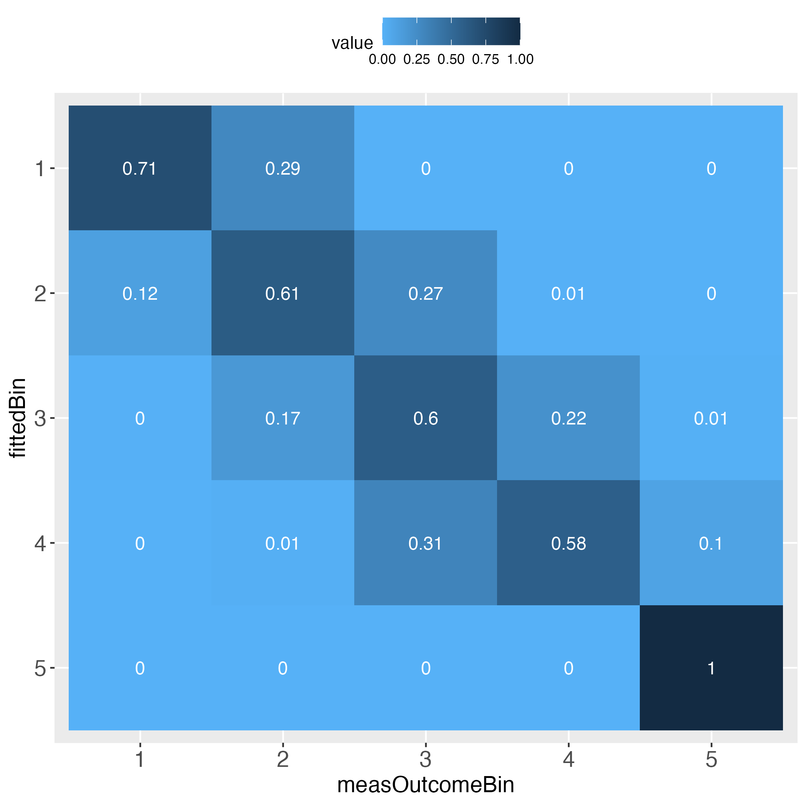
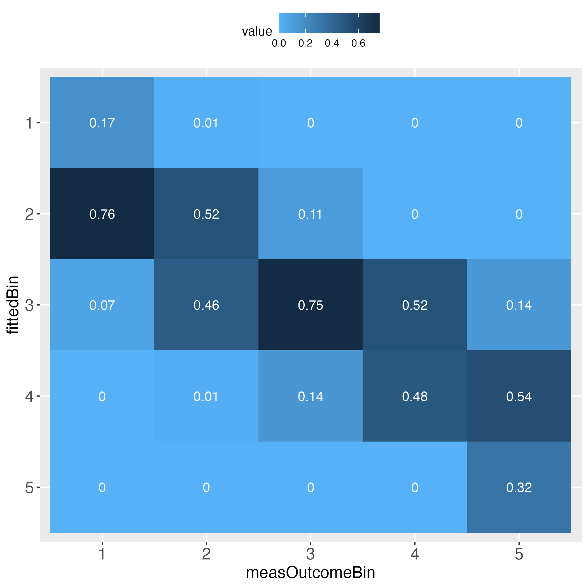
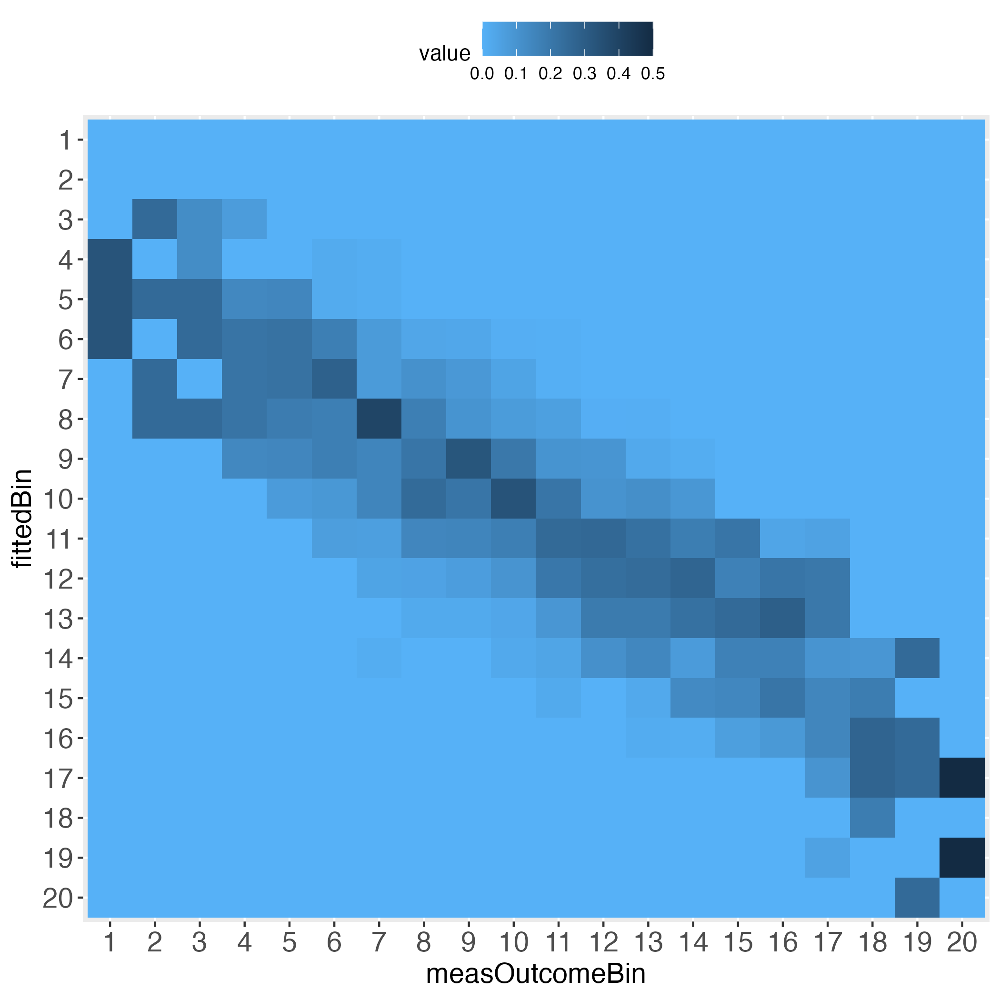
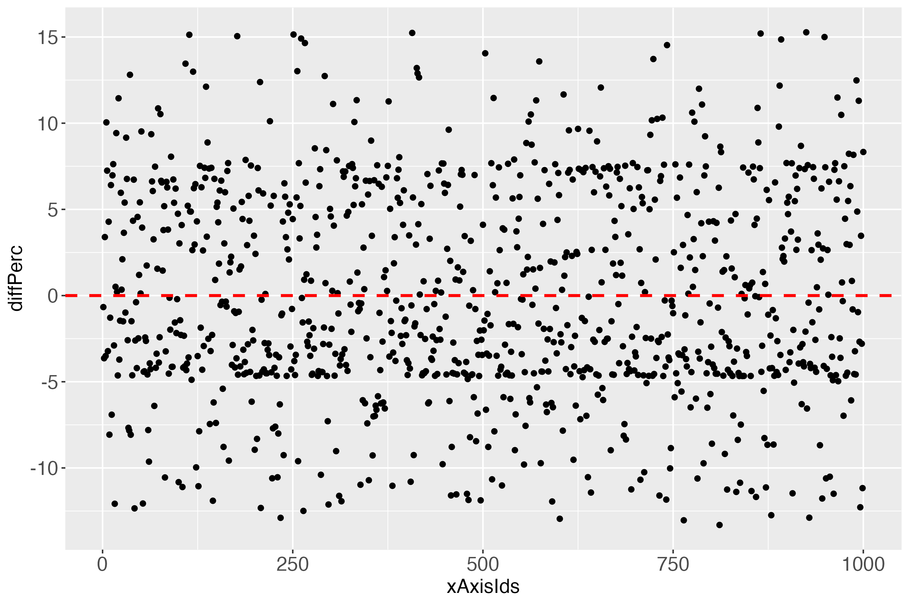
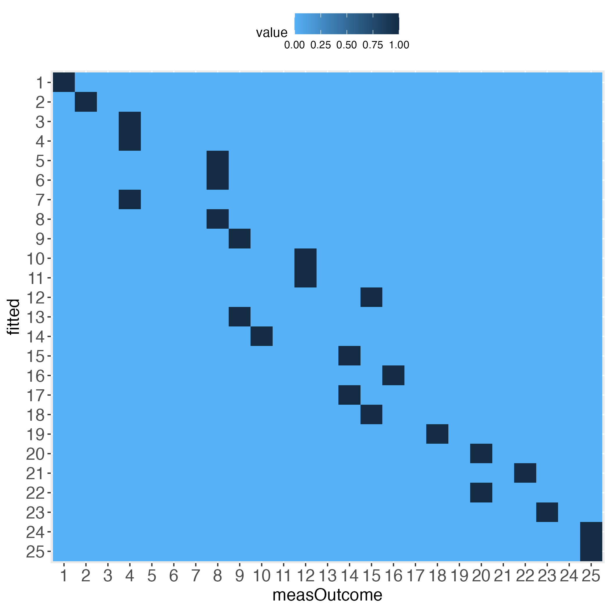
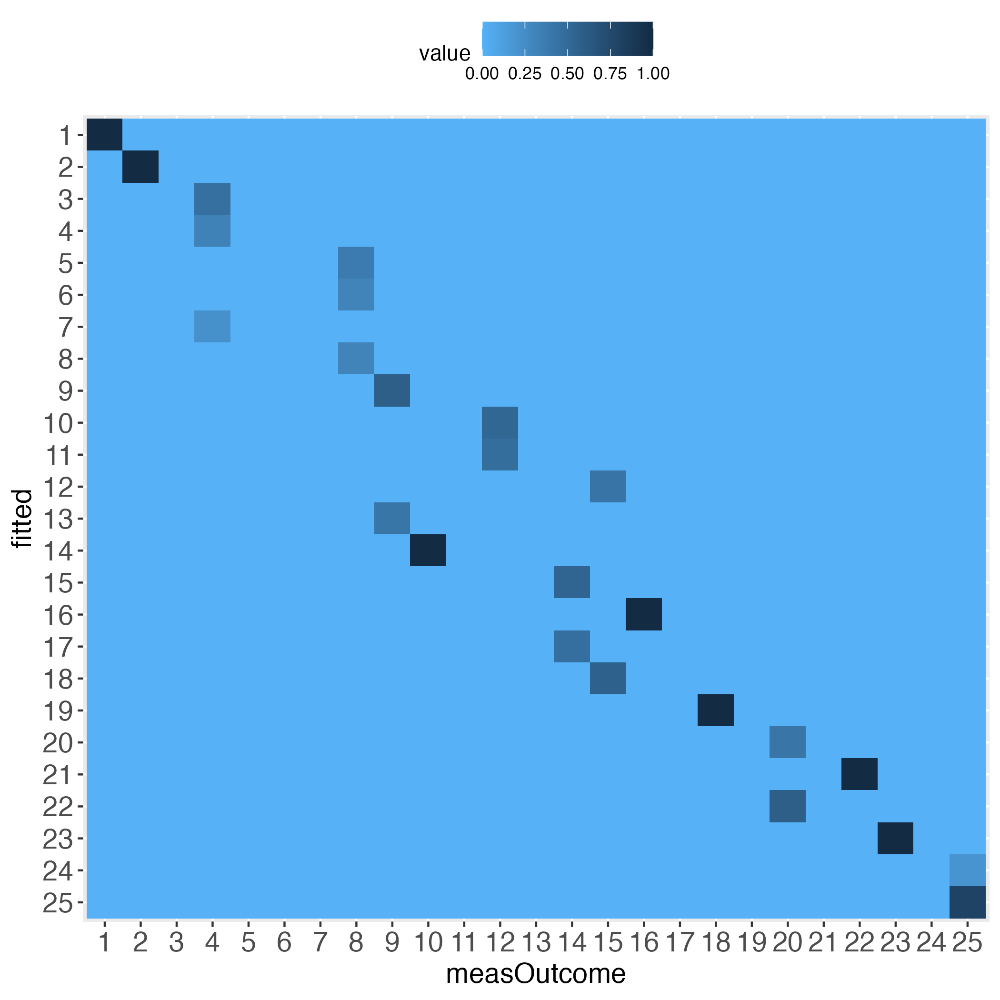

# predictMe

R package to visualize individual prediction performance

> 2022-05-14: Submitted package to CRAN, await manual check.

## Why?

There is no quick and easy way so far (to the best of my knowledge) to
evaluate the performance of a machine learning (ML) algorithm, as it
pertains to the individual level. That is what the ‘Me’ stands for in
the predictMe package. That is, the ‘individual’ client, e.g., the
patient, who is claimed by ML researchers to be the main beneficiary of
ML research.

Without further ado, let’s start at the end: The main result of the
predictMe package.

The performance evaluation heatmap instantly and comprehensibly displays
all strengths and weaknesses of the predictions. A perfect performance
(only theoretically possible) has the value 1 across the diagonal
(darkest blue), whereas the worst performance has the value 0 across the
diagonal (lightest blue). This rule applies to both of the pairwise
plots. Plots must come in a pair, because one perspective makes no sense
without its complementary perspective.

Perfect prediction is practically impossible (in a probabilistic world).
Obviously then, we must ask how far away from perfection is tolerable,
in other words, how close to perfection can we get? Both heatmaps
visualize how often and how far away the algorithm failed to hit the
bull’s eye of each of the compared bins. The user can determine the
number of bins and whether the relative frequencies shall be displayed
in each cell.




## How to?

```R
library(predictMe)
```

### Continuous (c) outcome

#### Functions quickSim and binContinuous (c)

```R
# Simulate data set with continuous outcome (use all default values)
dfContinuous <- quickSim()
# Use multiple linear regression as algorithm to predict the outcome.
lmRes <- lm(y~x1+x2,data=dfContinuous)
# Extract measured outcome and the predicted outcome (fitted values)
# from the regression output, put both in a data.frame.
lmDf <- data.frame(measOutcome=lmRes$model$y,
                   fitted=lmRes$fitted.values)
# Generate 5 equal bins (transformed outcome 0-100, bin width 20, # yields 5 bins).
x100c <- binContinuous(x=lmDf, measColumn = 1, binWidth = 20)
```

Important: The function **binContinuous** rescales the original outcome
scale (via linear transformation), so that it ranges between 0 and 100.
As emphasized in the **Details** of the R documentation of this
function, if any of the extreme values of the original scale have not
been obtained, e.g., none of the study participants selected the value 1
on a scale between 1 and 6, then the user will have to pass the full
original scale to the function **binContinuous**, using the function
argument range_x, e.g., range_x = c(1, 6). If the extreme values have
been obtained, the user may ignore the argument range_x, meaning that
**binContinuous** will compute the range internally and use the result
for transforming the scale.

#### Function makeTablePlot (c)

Let’s see what the function makeTablePlot produces.
```R
# Demand the visualized performance, using makeTablePlot
outLs <- makeTablePlot(x100c[["xTrans"]][,1:2], measColumn = 1, plot = TRUE)
# Display names of the resulting list
cbind(names(outLs))
```

Let’s get an impression of the output data, which is part of outLs (see
previous code block):

```R
# Show some lines of the data:
head(x100c[["xTrans"]])
```

Columns *measOutcomeBin* and *fittedBin* are plotted against one another
in the introductory heatmaps.

Columns *measOutcome* and *fitted* are the measured and predicted
outcome, respectively.

The column *diff* displays the difference between the columns
*measOutcome* and *fitted*. The column *xAxisIds* displays the unique
identifier of each individual, which may be used as x-axis in the
predictMe function makeDiffPlot (see below).

Let’s have a look at the total counts overview:
```R
# Display total count table
outLs$totalCountTable
```

The rows (*fittedBin*) display how many of the predicted outcome values
fall into each bin (binWidth = 20 = 5 bins: 0-20, \>20-40, \>40-60,
\>60-80, \>80-100), and how these bins correspond to the same bins of
the measured outcome values (*measOutcomeBin*). We instantly see that
there are numbers outside the diagonal, which is normal. What we want to
know is whether the algorithm still did a ‘good enough’ job, both
overall and in detail. For instance, categories 1, 4 and 5 appear
problematic insofar, as one total count outside of the diagonal is
greater than the number on the diagonal, e.g., bin no.1 displays 5 times
bull’s eye, but 22 times next to bull’s eye, and 2 times a failure by
even 2 bins.

The next two tables display the relative frequencies of the total count
table. First, taking the perspective of each row (each row sums up to
1). This is displayed in the introductory heatmap on the left.
```R
# Display row sum table
outLs$rowSumTable
```

Second, taking the perspective of each column (each column sums up to
1). This is displayed in the introductory heatmap on the right.

```R
# Display column sum table
outLs$colSumTable
```

Depending on how many bins the user selected, the heatmaps’ information
approximates the prediction performance on the individual level. For
instance, set binWidth to 5 (instead of 20), to produce 20 bins (instead
of 5 bins).

```R
# Generate 20 equal bins.
x100c5 <- binContinuous(x=lmDf, measColumn = 1, binWidth = 5)
# Demand the visualized performance, using makeTablePlot. Setting plotCellRes
# (Res = results) to FALSE means to not print the results into the cells.
outLs5 <- makeTablePlot(x100c5[["xTrans"]][,1:2], measColumn = 1,
                        plot = TRUE, plotCellRes = FALSE)
```




Approximating the individual level prediction performance is one way to
go. To complement this, the user may want to directly plot the
individual deviations from the zero difference line (deterministically
perfect prediction). This can be done with the makeDiffPlot function.

#### Function makeDiffPlot (c)

```R
# Demand the visualized differences, using makeDiffPlot
outDiffLs <- makeDiffPlot(x100c[["xTrans"]][,5:6], idCol = 2)
```

<figure>
<figcaption aria-hidden="true">Figure 5</figcaption>
</figure>

According to the total count table (binWidth = 20 = 5 bins), there were
some cases that were not 1 bin, but even 2 bins away from the bull’s
eye. Who are they? What is going on there? For finding clues about such
questions, this pilot version of the predictMe package (version 0.1)
currently provides the function makeDiffPlotColor (see next subsection).

#### Function makeDiffPlotColor (c)

```R
# Use the function makeDiffPlotColor
dpc <- makeDiffPlotColor(x100c[["xTrans"]][,5:7], idCol = 2, colorCol = 3)
```

<figure>
<figcaption aria-hidden="true">Figure 6</figcaption>
</figure>

In the **Details** of the documentation of the function
makeDiffPlotColor, I recommend to use the ggplot2 function facet_wrap,
to make the colorized plot easier to comprehend:

```R
# Use makeDiffPlotColor output and add a 'facet'
dpcFacet <- dpc$diffPlotColor + ggplot2::facet_wrap(~absBinDiff)
```

<figure>
<figcaption aria-hidden="true">Figure 7</figcaption>
</figure>

Such and probably many other detailed investigations could be conducted,
if one wanted to focus on several aspects of the individual prediction
performance, be it particularly accurate predictions or particularly
inaccurate ones, or in between.

Notably, it might initially appear surprising that some differences of
almost zero (close to perfect prediction) can be 1 bin away from the
bull’s eye bin (green points in figure 7, very close to the dashed red
line). The explanation for this is an individual’s measured outcome
being very close to the border of one bin, e.g., 40.01, while the
predicted outcome was very close to this border, but still in the lower
bin, e.g., 39.99.

### Binary (b) outcome


Looks perfect (when using simulated data and a bin width of 20).

The main difference to using a continuous outcome is that the binary
outcome does not need to be rescaled to range between 0 and 100. It
merely needs to be multiplied by 100. That is, prediction research that
uses binary outcomes, practically always use the so-called response as
output. The response is the estimated probability that the outcome will
take place. Probabilities by definition range between 0 and 1, which is
why multiplying them by 100 returns these probabilities as a percentage.

In terms of visualizing the algorithm’s individual prediction
performance, this is the exact same situation as to when the outcome was
continuous (after being rescaled (linearly transformed) to range between
0 and 100).

#### Functions quickSim and binBinary (b)

```R
# Simulate data set with binary outcome
dfBinary <- quickSim(type="binary")
# Use logistic regression as algorithm to predict the response variable
# (estimated probability of outcome being present).
glmRes <- glm(y~x1+x2,data=dfBinary,family="binomial")
# Extract measured outcome and the predicted probability (fitted values)
# from the logistic regression output, put both in a data.frame.
glmDf <- data.frame(measOutcome=glmRes$model$y,
                    fitted=glmRes$fitted.values)
# Apply function binBinary, set binWidth to 20.
x100b <- binBinary(x=glmDf, measColumn = 1, binWidth = 20)
```

Another difference between the binary and the continuous outcome is how
to compare the algorithm’s predictions with the measured outcome. Having
a continuous outcome, the algorithm predicts the outcome also on a
continuous scale. This is not true of a binary outcome. The measured
outcome is binary, whereas the predicted outcome is usually continuous
(predicted probabilities that range between 0 and 1). Therefore, with
the binary outcome, first the predicted probabilities are categorized
into equal bins, after which the mean number of measured outcome events
is computed for each bin. This is the basis for comparing the observed
frequency of the outcome with the respective bin. Let’s look at the data
to clarify what this means:

```R
# Use part of the output of function binBinary, in particular: Display
# one row per bin (binWidth = 20 = 5 bins)
idx1RowPerBin <- match((1:5), x100b[["xTrans"]]$measOutcome)
# Display only the first 4 columns
x100b[["xTrans"]][idx1RowPerBin,1:4]
```

Ignore the line numbers 3, 17, …, 1.

For instance, the first bin of predicted probabilities (column *fitted*)
ranges between 0 and 0.2 (or 0 and 20, in percent). In this bin, the
mean number of measured events was 7.69 percent. This is the relative
frequency of the binary outcome in this bin, that is, a constant number.
The predicted probability, on the other hand (column *fittedPerc*) is
not a constant number. The number 4.298 is only the first instance that
was found, when using the function match (see previous code block).
Let’s check the summary of predicted probabilities (*fittedPerc*) in the
first bin to get an idea of their range.

Note that ‘the first bin’ in this specific vignette needs no further
specification, because for the binWidth of 20, all predicted probability
bins perfectly align with the bins of the relative frequencies of the
measured binary outcome (see introductory heatmaps: Value 1 across the
diagonal).

```R
# Summary of column fittedPerc for the first bin
idxFirstBin <- x100b[["xTrans"]]$measOutcome==1
summary(x100b[["xTrans"]][idxFirstBin,"fittedPerc"])
```

In the first bin the predicted probabilities range between 0.004 percent
and 19.76 percent.

For a well-performing algorithm, in the first bin we expect the mean
number of the measured outcome to be somewhere between 0 and 20 percent.
If this mean number in this bin was above 20 percent, this may cause us
to be sceptical.

An algorithm might perform well in some bins, less well (or even bad) in
others. Visualizing this with the predictMe package instantly reveals
the strengths and weaknesses, in exactly the same way for binary
outcomes and for continuous outcomes.

#### Function makeTablePlot (b)

```R
# Demand the visualized performance, using makeTablePlot
outLs <- makeTablePlot(x100b[["xTrans"]][,1:2], measColumn = 1, plot = TRUE)
```

#### Function makeDiffPlot (b)

```R
# Demand the visualized differences, using makeDiffPlot
outDiffLs <- makeDiffPlot(x100b[["xTrans"]][,5:6], idCol = 2)
```

<figure>
<figcaption aria-hidden="true">Figure 10</figcaption>
</figure>

When looking at the individual differences (predicted probabilities in
percent; see y-axis diffPerc), we see that perfection in one plot (the
introductory heatmaps) must not imply perfection in another plot,
which - as noted - in the real (probabilistic) world is impossible.

This difference plot suggests, in combination with the perfect looking
introductory heatmaps, that colorizing this difference plot would be
futile. Let’s check: If the column *absBinDiff* has only one factor
level, then colorizing would not make sense in terms of obtaining more
detailed information, compared to figure 10.

```R
# How many levels?
nlevels(x100b[["xTrans"]][,"absDiffBins"])
```

As suspected, one factor level. Better use real data, I guess. But wait.
Let’s just select more bins, say 25? Then check the number of levels (we
want color, damn it!).

```
# Apply function binBinary, set binWidth to 4.
x100b4 <- binBinary(x=glmDf, measColumn = 1, binWidth = 4)
# How many levels?
nlevels(x100b4[["xTrans"]][,"absDiffBins"])
```

Was that so hard?

How do the heatmaps now look like?




Interestingly, the more the individual level gets approached, the wider
the gaps (lightest blue) along the diagonal become, at least with the
simulated data.

#### Function makeDiffPlotColor (b)

```R
# dpb: difference plot binary
dpb <- makeDiffPlotColor(x100b4[["xTrans"]][,5:7], idCol = 2, colorCol = 3)
# Use makeDiffPlotColor output and add a 'facet'
dpbFacet <- dpb$diffPlotColor + ggplot2::facet_wrap(~absDiffBins)
```

<figure>
<figcaption aria-hidden="true">Figure 13: Colorized plot 1</figcaption>
</figure>

<figure>
<figcaption aria-hidden="true">Figure 14: Colorized plot 2, having added the ggplot2 function facet_wrap</figcaption>
</figure>

For further explanations regarding the main intended purpose of this
predictMe package, please see this package’s documentation, that is, in
the documentation, click on the predictMe documentation.

**Final note**: For demonstration purposes only, the full simulated data
set (*N* = 1000) has been used both, for fitting the model and for
evaluating the individual prediction performance. In machine learning
(ML), this is the single most important mistake anyone can do.
Therefore, if you want to use the predictMe package for your ML
research, make sure that you extract the measured and the predicted
outcome values of the so-called test cases only. The test cases are the
individuals, with whom the trained (possibly tuned) algorithm was
cross-validated, to obtain the estimates of the possible real world
prediction performance of that algorithm.

**References**

Wickham H (2016). *ggplot2: Elegant Graphics for Data Analysis*.
Springer-Verlag New York. ISBN 978-3-319-24277-4,
<https://ggplot2.tidyverse.org>.
