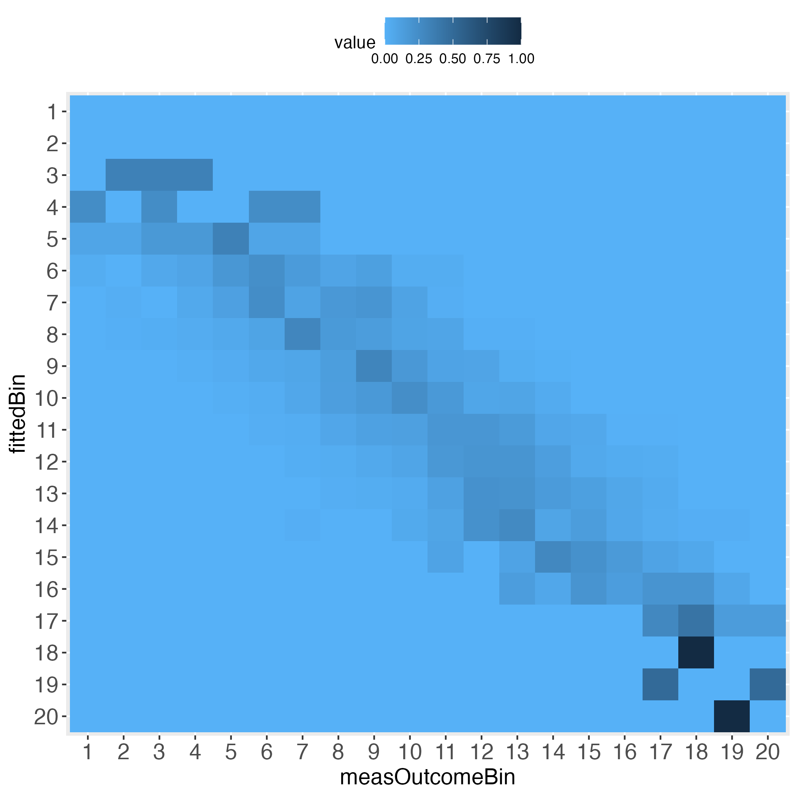
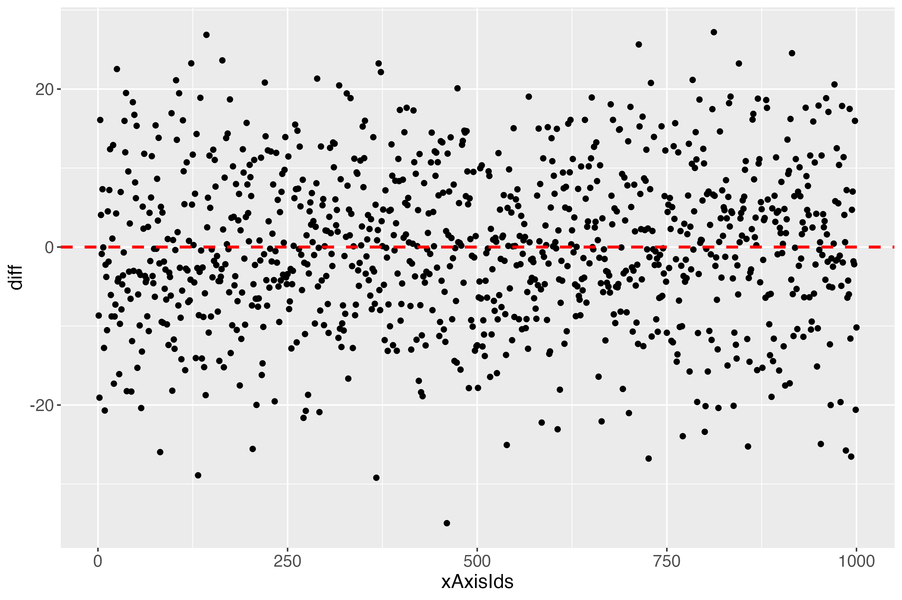
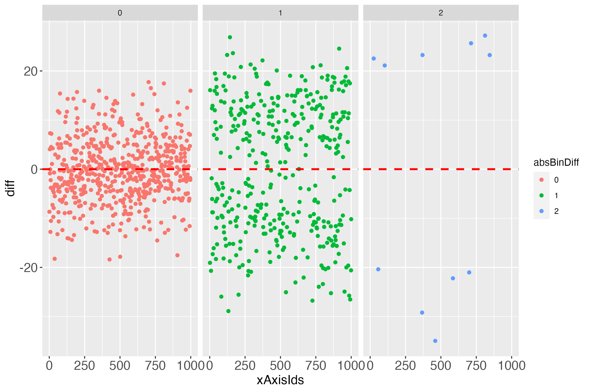
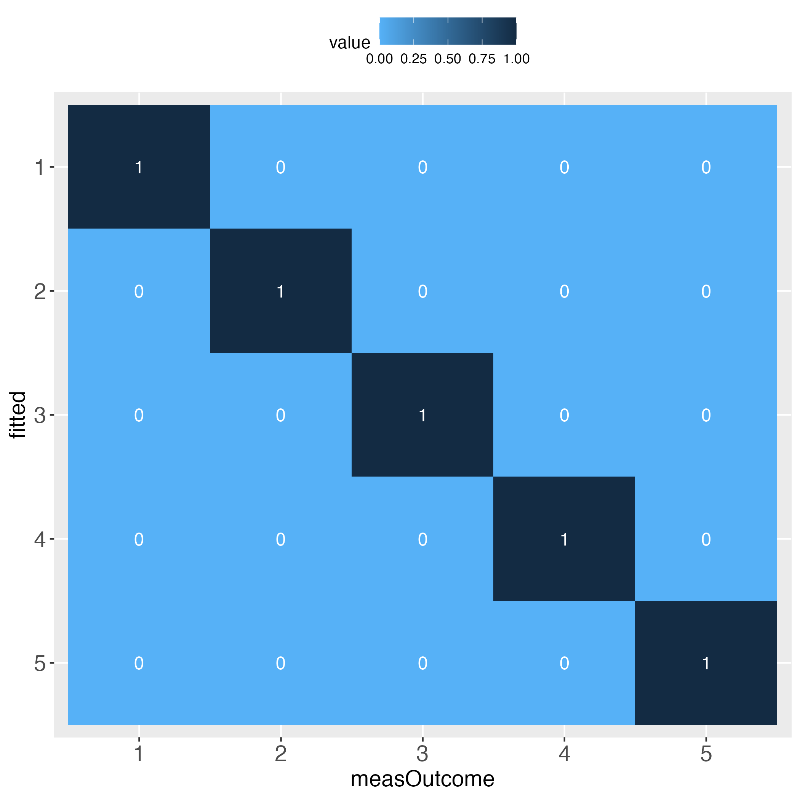

# predictMe

R package to visualize individual prediction performance

> 2022-05-14: Submitted package to CRAN, await manual check.

## predictMe - Visualize Individual Prediction Performance

1. Disadvantages
  + No single numeric summary result.
2. Advantages
  + No single numeric summary result (no copy paste error).
  + Output is mainly visual.
  + Worst and best 'result' clearly defined.
  + Visual output instantly comprehensible.
  + Overall and detailed feedback all in one.
  + Weaknesses as visible as strengths.
  + Independent of algorithm or software (only 2 output columns required).

Depending on the specific research topic and personal preferences, the perceived (dis-)advantages are probably different.

**predictMe** is an easy way in R to visually explore possible (dis-)advantages of the individual prediction performance of any algorithm, as long as the outcome is either continuous or binary.

## Why?

There is no quick and easy way so far (to the best of my knowledge) to evaluate the performance of a machine learning (ML) algorithm, as it pertains to the individual level. That is what the 'Me' stands for in the predictMe package. That is, the 'individual' client, e.g., the patient, who is claimed by ML researchers to be the main beneficiary of ML research.

Without further ado, let's start at the end: The main result of the predictMe package.

The performance evaluation heatmap instantly and comprehensibly displays all strengths and weaknesses of the predictions. A perfect performance (only theoretically possible) has the value 1 across the diagonal, whereas the worst performance has the value 0 across the diagonal. This rule applies to both of the pairwise plots. Plots must come in a pair, because one perspective makes no sense without its complementary perspective.

Perfect prediction is practically impossible (in a probabilistic world). Obviously then, we must ask how far away from perfection is tolerable, in other words, how close to perfection can we get? Both heatmaps visualize how often and how far away the algorithm failed to hit the bull's eye of each of the compared bins. The user can determine the number of bins and whether the relative frequencies of bin concordance shall be displayed in each cell.

BEWARE: Many researchers are strongly opposed to the binning of continuous data, including me. However, sometimes the benefits may outweigh the flaws (knowing that flawless methods do not exist). I emphasize that the predictMe package provides previously unavailable and potentially important **visual** information. I therefore argue that some data information loss or reduced statistical power (due to binning) appear not as relevant here, compared to a method that evaluates prediction performance numerically, as opposed to visually. This opinion of mine partly draws from the notion of methodological pluralism (Levitt et al., 2020).


Please pay attention to the legend on top of **each** heatmap: Darkest blue is the overall highest percentage of bin concordance. In the left plot this is 1 (bottom right), whereas in the right plot it is 0.76 (row 2, left).

## How to?

```R
library(predictMe)
```

### Continuous (c) outcome

#### Functions quickSim and binContinuous (c)

```R
# Simulate data set with continuous outcome (use all default values)
dfContinuous <- quickSim()
# Use multiple linear regression as algorithm to predict the outcome.
lmRes <- lm(y~x1+x2,data=dfContinuous)
# Extract measured outcome and the predicted outcome (fitted values)
# from the regression output, put both in a data.frame.
lmDf <- data.frame(measOutcome=lmRes$model$y,
                   fitted=lmRes$fitted.values)
# Generate 5 equal bins (transformed outcome 0-100, bin width 20, # yields 5 bins).
x100c <- binContinuous(x=lmDf, measColumn = 1, binWidth = 20)
```

Important: The function **binContinuous** rescales the original outcome
scale (via linear transformation), so that it ranges between 0 and 100.
As emphasized in the **Details** of the R documentation of this
function, if any of the extreme values of the original scale have not
been obtained, e.g., none of the study participants selected the value 1
on a scale between 1 and 6, then the user will have to pass the full
original scale to the function **binContinuous**, using the function
argument range_x, e.g., range_x = c(1, 6). If the extreme values have
been obtained, the user may ignore the argument range_x, meaning that
**binContinuous** will compute the range internally and use the result
for transforming the scale.

Let’s get an impression of the output data, which is part of x100c (see previous code block):

```R
# Show some lines of the data:
head(x100c[["xTrans"]])
```

```
Output in R console
  measOutcomeBin fittedBin measOutcome   fitted        diff xAxisIds absBinDiff
1              3         3    49.07609 57.74684  -8.6707498        1          0
2              3         4    44.05657 63.12596 -19.0693914        2          1
3              3         2    52.56371 36.47623  16.0874868        3          1
4              4         4    68.05227 63.98939   4.0628725        4          0
5              3         3    52.96387 53.83204  -0.8681698        5          0
6              2         2    36.07562 28.75503   7.3205928        6          0
```

Columns *measOutcomeBin* and *fittedBin* are plotted against one another
in the introductory heatmaps.

Columns *measOutcome* and *fitted* are the measured and predicted
outcome, respectively.

The column *diff* displays the difference between the columns
*measOutcome* and *fitted*. The column *xAxisIds* displays the unique
identifier of each individual, which may be used as x-axis in the
predictMe function makeDiffPlot (see below).

#### Function makeTablePlot (c)

Let’s see what the function makeTablePlot produces.
```R
# Demand the visualized performance, using makeTablePlot
outLs <- makeTablePlot(x100c[["xTrans"]][,1:2], measColumn = 1, plot = TRUE)
# Display names of the resulting list
cbind(names(outLs))
```

```
Output in R console
     [,1]              
[1,] "totalCountTable" 
[2,] "rowSumTable"     
[3,] "colSumTable"     
[4,] "rowSumTable_melt"
[5,] "colSumTable_melt"
[6,] "rowSumTable_plot"
[7,] "colSumTable_plot"
```

Let’s have a look at the total counts overview:
```R
# Display total count table
outLs$totalCountTable
```

```
Output in R console
         measOutcomeBin
fittedBin   1   2   3   4   5
        1   5   2   0   0   0
        2  22 114  50   1   0
        3   2 101 350 129   5
        4   0   3  64 120  20
        5   0   0   0   0  12
```

The rows (*fittedBin*) display how many of the predicted outcome values
fall into each bin (binWidth = 20 = 5 bins: 0-20, \>20-40, \>40-60,
\>60-80, \>80-100), and how these bins correspond to the same bins of
the measured outcome values (*measOutcomeBin*). We instantly see that
there are numbers outside the diagonal, which is normal. What we want to
know is whether the algorithm still did a ‘good enough’ job, both
overall and in detail. For instance, categories 1, 4 and 5 appear
problematic insofar, as one total count outside of the diagonal is
greater than the number on the diagonal, e.g., bin no.1 displays 5 times
bull’s eye, but 22 times next to bull’s eye, and 2 times a failure by
even 2 bins.

The next two tables display the relative frequencies of the total count
table. First, taking the perspective of each row (each row sums up to
1). This is displayed in the introductory heatmap on the left.
```R
# Display row sum table
outLs$rowSumTable
```

```
Output in R console
         measOutcomeBin
fittedBin           1           2           3           4           5
        1 0.714285714 0.285714286 0.000000000 0.000000000 0.000000000
        2 0.117647059 0.609625668 0.267379679 0.005347594 0.000000000
        3 0.003407155 0.172061329 0.596252129 0.219761499 0.008517888
        4 0.000000000 0.014492754 0.309178744 0.579710145 0.096618357
        5 0.000000000 0.000000000 0.000000000 0.000000000 1.000000000
```

Second, taking the perspective of each column (each column sums up to
1). This is displayed in the introductory heatmap on the right.

```R
# Display column sum table
outLs$colSumTable
```

```
Output in R console
         measOutcomeBin
fittedBin           1           2           3           4           5
        1 0.172413793 0.009090909 0.000000000 0.000000000 0.000000000
        2 0.758620690 0.518181818 0.107758621 0.004000000 0.000000000
        3 0.068965517 0.459090909 0.754310345 0.516000000 0.135135135
        4 0.000000000 0.013636364 0.137931034 0.480000000 0.540540541
        5 0.000000000 0.000000000 0.000000000 0.000000000 0.324324324
```

Depending on how many bins the user selected, the heatmaps’ information
approximates the prediction performance on the individual level. For
instance, set binWidth to 5 (instead of 20), to produce 20 bins (instead
of 5 bins).

```R
# Generate 20 equal bins.
x100c5 <- binContinuous(x=lmDf, measColumn = 1, binWidth = 5)
# Demand the visualized performance, using makeTablePlot. Setting plotCellRes
# (Res = results) to FALSE means to not print the results into the cells.
outLs5 <- makeTablePlot(x100c5[["xTrans"]][,1:2], measColumn = 1,
                        plot = TRUE, plotCellRes = FALSE)
```




Approximating the individual level prediction performance is one way to go. To complement this, the user may want to directly plot the individual deviations from the zero difference line (deterministically perfect prediction). This can be done with the makeDiffPlot function.

#### Function makeDiffPlot (c)

```R
# Demand the visualized differences, using makeDiffPlot
outDiffLs <- makeDiffPlot(x100c[["xTrans"]][,5:6], idCol = 2)
```

<figure>
<figcaption aria-hidden="true">Figure 5: Differences between measured and predicted outcome (y-axis) for each individual (x-axis).</figcaption>
</figure>


The x-axis (*xAxisIds*) shows all subjects, in this simulated data set: 1000. The y-axis (*diff*) shows the differences between the measures and the predicted outcome of each subject, using the linearly transformed scale between 0 and 100. The red dashed line shows the perfect prediction (where measured and predicted outcome are exactly alike).

According to the total count table (binWidth = 20 = 5 bins), there were some cases that were not 1 bin, but even 2 bins away from the bull's eye. Who are they? What is going on there? For finding clues about such questions, this pilot version of the predictMe package (version 0.1) currently provides the function makeDiffPlotColor (see next subsection).

#### Function makeDiffPlotColor (c)

```R
# Use the function makeDiffPlotColor
dpc <- makeDiffPlotColor(x100c[["xTrans"]][,5:7], idCol = 2, colorCol = 3)
```

<figure>
<figcaption aria-hidden="true">Figure 6: Same as figure 5, yet colorized due to the absolute bin difference that was computed for each individual.</figcaption>
</figure>


In the **Details** of the documentation of the function
makeDiffPlotColor, I recommend to use the ggplot2 function facet_wrap,
to make the colorized plot easier to comprehend:

```R
# Use makeDiffPlotColor output and add a 'facet'
dpcFacet <- dpc$diffPlotColor + ggplot2::facet_wrap(~absBinDiff)
```

<figure>
<figcaption aria-hidden="true">Figure 7: Points of figure 6, separated by absolute bin differences.</figcaption>
</figure>


Such and probably many other detailed investigations could be conducted, if one wanted to focus on several aspects of the individual prediction performance, be it particularly accurate predictions or particularly inaccurate ones, or in between.

Notably, it might initially appear surprising that some differences of almost zero (close to perfect prediction) can be 1 bin away from the bull's eye bin (green points in figure 7, very close to the dashed red line). The explanation for this is an individual's measured outcome being very close to the border of one bin, e.g., 40.01, while the predicted outcome was very close to this border, but still in the lower bin, e.g., 39.99. For a further short discussion of this evident flaw, see headline 'Bin noise' at the bottom of this vignette.

### Binary (b) outcome




Looks perfect (when using simulated data and a bin width of 20).

The main difference to using a continuous outcome is that the binary outcome does not need to be rescaled to range between 0 and 100. It merely needs to be multiplied by 100. That is, prediction research that uses binary outcomes, practically always use the so-called response as output. The response is the estimated probability that the outcome will take place. Probabilities by definition range between 0 and 1, which is why multiplying them by 100 returns these probabilities as a percentage.

In terms of visualizing the algorithm's individual prediction performance, this is the exact same situation as to when the outcome was continuous (after being rescaled (linearly transformed) to range between 0 and 100).

#### Functions quickSim and binBinary (b)

```R
# Simulate data set with binary outcome
dfBinary <- quickSim(type="binary")
# Use logistic regression as algorithm to predict the response variable
# (estimated probability of outcome being present).
glmRes <- glm(y~x1+x2,data=dfBinary,family="binomial")
# Extract measured outcome and the predicted probability (fitted values)
# from the logistic regression output, put both in a data.frame.
glmDf <- data.frame(measOutcome=glmRes$model$y,
                    fitted=glmRes$fitted.values)
# Apply function binBinary, set binWidth to 20.
x100b <- binBinary(x=glmDf, measColumn = 1, binWidth = 20)
```

Another difference between the binary and the continuous outcome is how to compare the algorithm's predictions with the measured outcome. Having a continuous outcome, the algorithm predicts the outcome also on a continuous scale. This is not true of a binary outcome. The measured outcome is binary, whereas the predicted outcome is usually continuous (predicted probabilities that range between 0 and 1). Therefore, with the binary outcome, first the predicted probabilities are categorized into equal bins, after which the mean number of measured outcome events is computed for each bin. This is the basis for comparing the observed frequency of the outcome with the respective bin. Let's look at the data to clarify what this means:

```R
# Use part of the output of function binBinary, in particular: Display
# one row per bin (binWidth = 20 = 5 bins)
idx1RowPerBin <- match((1:5), x100b[["xTrans"]]$measOutcome)
# Display only the first 4 columns
x100b[["xTrans"]][idx1RowPerBin,1:4]
```

```
Output in R console
   measOutcome fitted measOutcomePerc fittedPerc
3            1      1        7.692308   4.298254
17           2      2       31.313131  30.805328
16           3      3       46.987952  59.066078
12           4      4       66.666667  73.577654
1            5      5       95.333333  96.002061
```

Ignore the line numbers 3, 17, ..., 1.

For instance, the first bin of predicted probabilities (column *fitted*) ranges between 0 and 0.2 (or 0 and 20, in percent). In this bin, the mean number of measured events was 7.69 percent. This is the relative frequency of the binary outcome in this bin, that is, a constant number. The predicted probability, on the other hand (column *fittedPerc*) is not a constant number. The number 4.298 is only the first instance that was found, when using the function match (see previous code block). Let's check the summary of predicted probabilities (*fittedPerc*) in the first bin to get an idea of their range.

Note that 'the first bin' in this specific vignette needs no further specification, because for the binWidth of 20, all predicted probability bins perfectly align with the bins of the relative frequencies of the measured binary outcome (see introductory heatmaps: Value 1 across the diagonal).

```R
# Summary of column fittedPerc for the first bin
idxFirstBin <- x100b[["xTrans"]]$measOutcome==1
summary(x100b[["xTrans"]][idxFirstBin,"fittedPerc"])
```

```
Output in R console
     Min.   1st Qu.    Median      Mean   3rd Qu.      Max. 
 0.003784  0.990428  4.364189  6.311213 10.960193 19.756161
```

In the first bin the predicted probabilities range between 0.004 percent and 19.76 percent.

For a well-performing algorithm, in the first bin we expect the mean number of the measured outcome to be somewhere between 0 and 20 percent. If this mean number in this bin was above 20 percent, this may cause us to be sceptical.

An algorithm might perform well in some bins, less well (or even bad) in others. Visualizing this with the predictMe package instantly reveals the strengths and weaknesses, in exactly the same way for binary outcomes and for continuous outcomes.

#### Function makeTablePlot (b)

```R
# Demand the visualized performance, using makeTablePlot
outLs <- makeTablePlot(x100b[["xTrans"]][,1:2], measColumn = 1, plot = TRUE)
```

#### Function makeDiffPlot (b)

```R
# Demand the visualized differences, using makeDiffPlot
outDiffLs <- makeDiffPlot(x100b[["xTrans"]][,5:6], idCol = 2)
```

<figure>
<figcaption aria-hidden="true">Figure 10: Differences between mean event rate and predicted outcome probability (y-axis) for each individual (x-axis).</figcaption>
</figure>


When looking at the individual differences (predicted probabilities in percent; see y-axis *diffPerc*), we see that perfection in one plot (the introductory heatmaps for the binary outcome) must not imply perfection in another plot, which - as noted - in the real (probabilistic) world is impossible.

This difference plot suggests, in combination with the perfect looking introductory heatmaps, that colorizing this difference plot would be futile. Let's check: If the column *absBinDiff* has only one factor level, then colorizing would not make sense in terms of obtaining more detailed information, compared to figure 10.

```R
# How many levels?
nlevels(x100b[["xTrans"]][,"absDiffBins"])
```

```
Output in R console
[1] 1
```

As suspected, one factor level. Better use real data, I guess. But wait. Let's just select more bins, say 25? Then check the number of levels (we want color, damn it!).

```
# Apply function binBinary, set binWidth to 4.
x100b4 <- binBinary(x=glmDf, measColumn = 1, binWidth = 4)
# How many levels?
nlevels(x100b4[["xTrans"]][,"absDiffBins"])
```

```
Output in R console
[1] 5
```

Was that so hard?

How do the heatmaps now look like?


Interestingly, the more the individual level gets approached, the wider the gaps (lightest blue) along the diagonal become, at least with the simulated data.

#### Function makeDiffPlotColor (b)

```R
# dpb: difference plot binary
dpb <- makeDiffPlotColor(x100b4[["xTrans"]][,5:7], idCol = 2, colorCol = 3)
# Use makeDiffPlotColor output and add a 'facet'
dpbFacet <- dpb$diffPlotColor + ggplot2::facet_wrap(~absDiffBins)
```

<figure>
<figcaption aria-hidden="true">Figure 13: Colorized plot 1</figcaption>
</figure>

<figure>
<figcaption aria-hidden="true">Figure 14: Colorized plot 2, having added the ggplot2 function facet_wrap</figcaption>
</figure>


## Bin noise

Introducing noise clearly is a flaw that comes with binning continuous data. However, researchers might still draw important information from the above visualizations. For instance, one might compute the percentage of cases in the sample that display this unwanted noise, and take this percentage into account when using the visual output to evaluate prediction performance on the individual level.

Regarding the intended purpose of the main visual output of the predictMe package, I choose to argue in favor of a method that presents potentially important information, where the inherent flaws are evidently visible, compared to a method without these (but other) flaws, which are very often implicit (not visible). I see a similarity, in some way, to what John Tukey said at the beginning of section 11 'Facing uncertainty' (1962): 'Far better an approximate answer to the right question, which is often vague, than the exact answer to the wrong question, which can always be made precise'.

## Misc and References

For further explanations regarding the main intended purpose of this predictMe package, please see this package's documentation, that is, in the documentation, click on the predictMe documentation. Alternatively, load the predictMe package, then enter in the R console: ?predictMe::predictMe

**Final note**: For demonstration purposes only, the full simulated data set (*N* = 1000) has been used both, for fitting the model and for evaluating the individual prediction performance. In machine learning (ML), this is the single most important mistake anyone can do. Therefore, if you want to use the predictMe package for your ML research, make sure that you extract the measured and the predicted outcome values of the so-called test cases only. The test cases are the individuals, with whom the trained (possibly tuned) algorithm was cross-validated, to obtain the estimates of the possible real world prediction performance of that algorithm.

**References**

Levitt, H. M., Surace, F. I., Wu, M. B., Chapin, B., Hargrove, J. G., Herbitter, C., Lu, E. C., Maroney, M. R., & Hochman, A. L. (2020). The meaning of scientific objectivity and subjectivity: From the perspective of methodologists. *Psychological Methods*. [https://doi.org/10.1037/met0000363](https://doi.org/10.1037/met0000363)

Tuckey, J. W. (1962). The Future of Data Analysis. *The Annals of Mathematical Statistics*, *33*(1), 1-67. [https://www.jstor.org/stable/2237638](https://www.jstor.org/stable/2237638)

Wickham H (2016). *ggplot2: Elegant Graphics for Data Analysis*. Springer-Verlag New York. ISBN 978-3-319-24277-4, [https://ggplot2.tidyverse.org](https://ggplot2.tidyverse.org).
